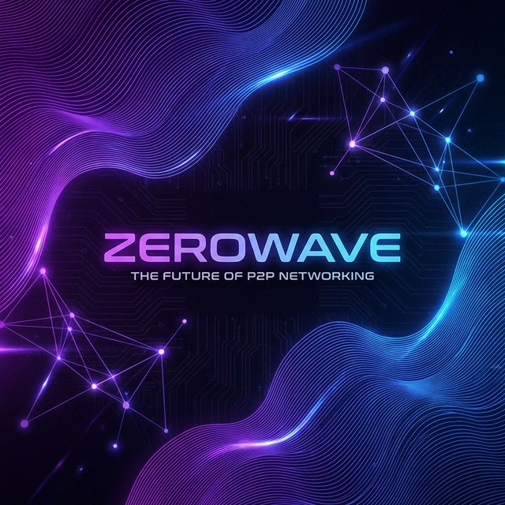
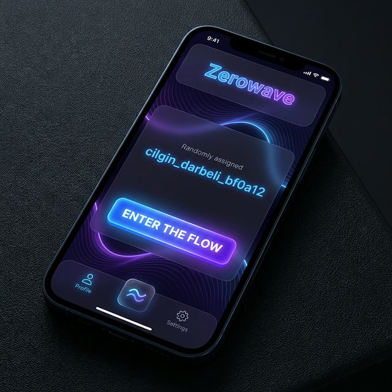
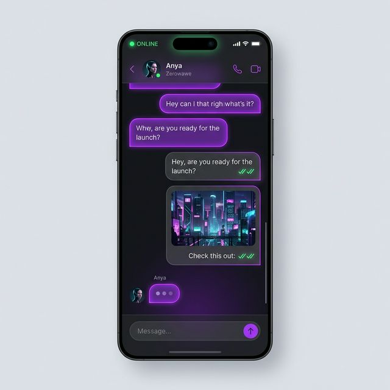
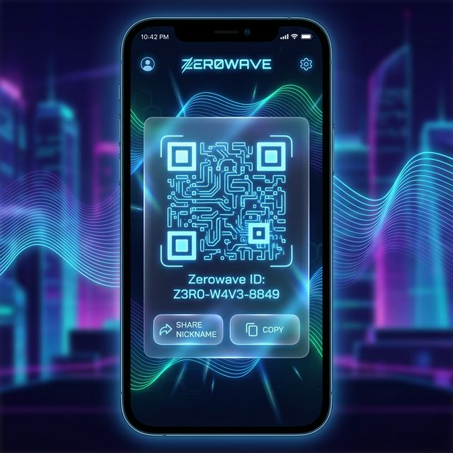

# 🌊 Zerowawe

**Zerowawe**, peer-to-peer (P2P) mesajlaşmanın en saf ve anonim halidir. Hesap açma, şifre hatırlama veya merkezi bir sunucuya güvenme derdi yok. Sadece bir nick al, dalga boyunu paylaş ve konuşmaya başla.

## 🚀 Öne Çıkan Özellikler

- **🛡️ %100 Anonim:** Kayıt yok, e-posta yok, telefon numarası yok. Sadece rastgele atanan bir kimlik.
- **📡 Gerçek P2P:** Mesajlarınız hiçbir sunucuya uğramaz. WebRTC teknolojisi ile doğrudan cihazdan cihaza aktarılır.
- **💎 Infinite Identity:** IPv6 tarzı, trilyonlarca kombinasyona sahip eşsiz nickname algoritması.
- **🖼️ Medya Paylaşımı:** Fotoğrafları P2P güvenliğiyle sıfır iz bırakarak gönderin.
- **📲 Kolay Erişim:** QR kod veya Native Share ile nickinizi saniyeler içinde arkadaşınıza ulaştırın.
- **🎨 Neon-Wave UI:** Karanlık mod, pürüzsüz animasyonlar ve premium glassmorphism tasarımı.

## 📸 Uygulama İçi Görüntüler

| Giriş Ekranı | Mesajlaşma | QR Paylaşım |
| :---: | :---: | :---: |
|  |  |  |

> [!NOTE]
> Yukarıdaki görseller uygulamanın vizyonunu yansıtan örnek tasarımlardır. Gerçek ve akıcı Zerowawe deneyimini, neon animasyonları ve pürüzsüz geçişleri bizzat görmek için uygulamayı denemeniz harika bir fikir olacaktır! 🚀

## 📦 Kurulum

En güncel APK dosyasına ulaşmak için:
👉 **[Tüm Sürümler ve APK İndirme Bağlantıları](./RELEASES.md)**

---

## 🛠️ Teknik Detaylar

- **Framework:** React + Vite
- **P2P Protocol:** WebRTC (PeerJS)
- **Mobile Foundation:** Capacitor JS
- **Styling:** Custom Vanilla CSS (Neon Wave Theme)

## ⚖️ Lisans

Bu proje bir "Zero Trace" girişimidir. İz bırakmaz, izlenemez.

---

> **"Identity is a wave, and we are the ocean."** 🌊⚡
